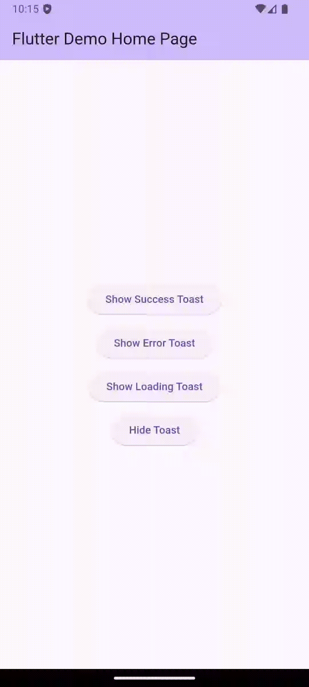

# Frosted Toast

Frosted Toast is a Flutter package designed to provide customizable and visually appealing toast notifications for your applications. Whether you need simple messages or rich, interactive toasts, Frosted Toast has you covered.

## Demo

Here’s a quick preview of Frosted Toast in action:

<div align="center">
    
</div>

## Getting started

To start using Frosted Toast, add the package to your `pubspec.yaml`:

```yaml
dependencies:
    frosted_toast: ^1.0.0
```

Then, run `flutter pub get` to fetch the package.

## Usage

Here’s a quick example of how to use Frosted Toast:

Before using the package, ensure you wrap your app with `FrostedToastOverlay` in the `builder` method of your `MaterialApp`. Here's an example:

```dart
class MyApp extends StatelessWidget {
    const MyApp({super.key});

    @override
    Widget build(BuildContext context) {
        return MaterialApp(
            title: 'Flutter Demo',
            home: const MyHomePage(title: 'Flutter Demo Home Page'),
            debugShowCheckedModeBanner: false,
            builder: (context, child) {
                return FrostedToastOverlay(
                    child: child ?? const MyHomePage(title: 'Flutter Demo Home Page'),
                );
            },
        );
    }
}
```


```dart
import 'package:frosted_toast/frosted_toast.dart';

void showToast(BuildContext context) {
    FrostedToastService.showToast(
      context,
      options: const FrostedToastOptions(
        message: 'Hello, Frosted Toast!',
        alignment: Alignment.bottomCenter,
        autoDismiss: true,
        duration: Duration(seconds: 3),
        child: Row(
          mainAxisSize: MainAxisSize.min,
          children: [
            Icon(Icons.check_circle, color: Colors.green),
            SizedBox(width: 8),
            Text('Operation Successful!'),
          ],
        ),
      ),
    );
}
```

For more examples, check the `/example` folder in the repository.
